# Hi there, I'm Klastic 👋

I'm a passionate developer who loves building things and learning new technologies.

## 🔭 What I'm Working On

- Building a set of packages for [Streamer.bot](https://streamer.bot) to extend streaming automation
- Working with [LostKode](https://github.com/LostKode) — an app/web dev company with the odd side project here and there
- Exploring new open-source projects and contributing to the developer community

## 🌱 Currently Learning

- **AI Agents** and agentic workflow design
- **Large-scale orchestration** systems (including work in the [Industrial Parasite](https://github.com/Industrial-Parasite) and [LostKode](https://github.com/LostKode) repos)
- Cloud architecture and DevOps practices
- Modern frontend and backend frameworks
- System design and scalable architectures

## 💻 Tech Stack

## 📊 GitHub Stats

 

## 👯 Looking to Collaborate On

- Streaming tools and Streamer.bot integrations
- Interesting open-source projects
- Tools that improve developer productivity
- Anything creative and challenging!

## 📫 How to Reach Me

---

⚡ *"The best way to predict the future is to invent it."* — Alan Kay
